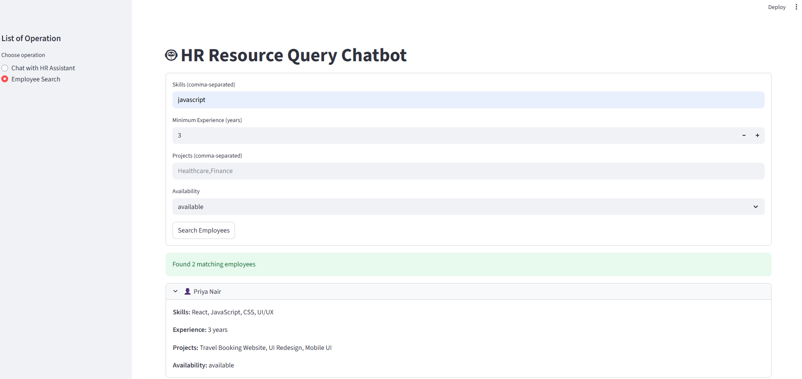

# HR Resource Query Chatbot  

## Overview 
The **HR Resource Query Chatbot** is an AI-powered assistant that helps HR teams quickly search, filter, and recommend employees based on skills, projects, experience, and availability.  
It uses a **Retrieval-Augmented Generation (RAG) pipeline** to retrieve employee profiles from a dataset and generate human-like responses.  
A Streamlit-based frontend is provided for interaction, and a FastAPI backend powers the AI logic and search functionalities.  

## Features  
- **Chat with HR Assistant** – Ask natural language queries like *“Who has Python and AWS skills?”*  
- **Employee Search** – Search by skills, projects, availability, or experience  
- **RAG-based response generation** – Combines context retrieval with AI model generation  
- **Structured employee data** – Store and retrieve profiles with skills, experience, and availability   
- **Interactive Streamlit UI** – User-friendly web interface  
- **FastAPI Backend** – Efficient API endpoints for search and chat  

## Architecture  
The system is divided into two main components:  

1. **Frontend (Streamlit)**  
   - Provides an interface for HR queries and employee search  
   - Sends requests to backend APIs  
   - Displays chatbot answers and employee search results  

2. **Backend (FastAPI)**  
   - `/chat` endpoint: Handles HR chatbot queries with RAG pipeline  
   - `/employees/search` endpoint: Filters employees based on query params  

## Setup & Installation
 - Clone repository
 - create and activate a virtual environment
    - python -m venv .venv
    - .venv\\Scripts\\activate
 - create and install dependencies using requirement.txt file
   - pip install -r requirements.txt
 - prepare data files - employees.json
 - configure credentials
 - write full code 
 - run fastapi backend  
   - uvicorn main:app --reload
 - run streamlit frontend
   - cd frontend
   - streamlit run app.py

## API Documentation 
Base url - http://127.0.0.1:8000

1. **Post/chat** -Generates an HR-styled recommendation for the query by retrieving relevant employee profiles and asking the LLM to generate a human-readable answer.

i/p - {
  "query": "Find Python developers with 3+ years experience"
}

o/p - After conducting a thorough search, we have identified one highly qualified candidate who meets the specified criteria of having 3+ years of experience as a Python developer.

Aarav Sharma has 4 years of experience in the field, with a strong background in projects such as E-commerce Backend, API Development, and Database Optimization, which are directly relevant to the query. His technical skills include Python, Django, REST API, and PostgreSQL, making him a suitable fit for the role. Additionally, Aarav Sharma is currently available, indicating that he can immediately contribute to the team.

Although Rohan Verma has 6 years of experience, his expertise lies more in cloud migration, infrastructure automation, and DevOps pipeline, with skills in AWS, Docker, Kubernetes, and Terraform. While he does not directly match the query for Python development experience, it's worth noting that his broad technical expertise could be valuable in a related context. However, Rohan Verma is currently busy, which may impact his availability for immediate projects.

If you would like more details about Aarav Sharma or would like to arrange a meeting to discuss how he can contribute to your team, please do not hesitate to contact us.

2. ** GET /employees/search** -Filter and list employees from the dataset.

i/p - curl "http://127.0.0.1:8000/employees/search?skills=Python,AWS&min_experience=3&availability=available"

o/p - {
  "count": 2,
  "employees": [
    {
      "id": 1,
      "name": "Aarav Sharma",
      "skills": ["Python", "Django", "REST API", "PostgreSQL"],
      "experience_years": 4,
      "projects": ["E-commerce Backend", "API Development"],
      "availability": "available"
    },
    {
      "id": 11,
      "name": "Vikram Desai",
      "skills": ["Data Analysis", "SQL", "Tableau", "Python"],
      "experience_years": 4,
      "projects": ["Sales Dashboard", "Customer Analytics"],
      "availability": "available"
    }
  ]
}

## AI Development Process 
- I used ChatGPT and GitHub Copilot as AI coding assistants.
- AI helped me in code generation, debugging, and writing API - logic.
- Around 60% of the code was AI-assisted, and the rest was - hand-written.
- AI gave me some optimized functions that saved time. 
- In some cases, like data preprocessing and project - structure, I solved it manually without AI.

## Technical Decisions
- **OpenAI vs open-source models**
  - Open AI models are paid ones ,run on there server, compare to open source it safety is question.
  - Open source models are free, we can download and deploy on our local machine or server to use.considered for security to our data.
-  **Local LLM (Ollama) vs cloud API considerations**
  - In local Computation resorces all handled by ourself, in cloud computation handles by cloud provider
-  **Performance vs cost vs privacy trade-offs**
  - performance wise in cloud provider there is frequent updates , but in open source we need to finetune or deploy new model everytime
  - cost wise - open source we go if we have make more request ,otherwise the infrastructure setup cost is high. closed source based on token we need to pay ,for smaller task like minimum number of call closed is better
  - privacy  - open source is better than closed because we have more control over the models and data .  

## Future Improvements
 - I have already tried to implement evaluation metrics logic for rag pipeline using RAGAS framework.if i had more time implement that evaluation or use llm model as judge to give better output.
 - this data looks like structure , so in future connect with sql database for data retrieval.
 - by using docker, github action , cloud platform - i will deploy the application and make it accessable to all.
 
## Demo - Scereenshot

